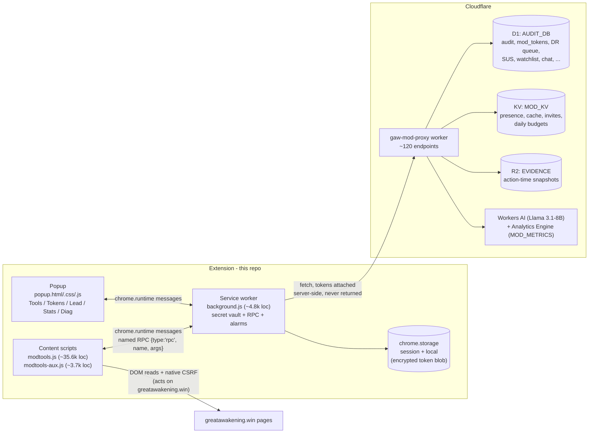
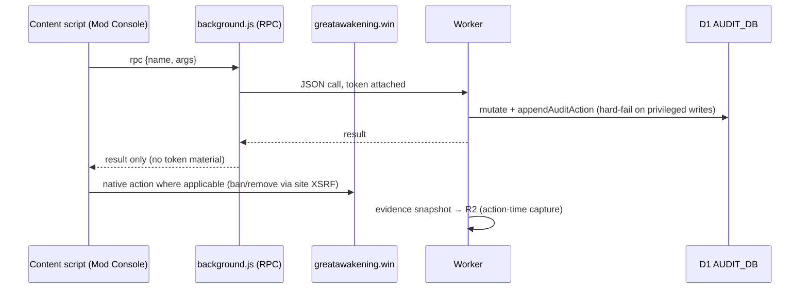

# GAW ModTools — Architecture (C4-lite)

Describes the system as of **extension v10.50.1** (commit `4e79c17`), read from
`manifest.json`, `modtools.js`, `modtools-aux.js`, `background.js`, `popup.*`,
`docs/AGENT_BRIEF.md`, and `docs/FEATURES_INDEX.md`. Companion doc:
[PROJECT_SUMMARY.md](PROJECT_SUMMARY.md).

The system has two deployable halves:

1. **Chrome MV3 extension (this repo)** — overlays moderation tooling on greatawakening.win.
2. **Cloudflare Worker backend (companion repo `D:\AI\_PROJECTS\cloudflare-worker\`, not tracked here)** — `gaw-mod-proxy-v2.js`, ~120 endpoints, plus the D1/KV/R2/AI bindings behind them.

---

## 1. System context (C1)

```mermaid
flowchart TB
    mod["Moderator (lead / sub-mod)\nChrome 116+, distributed unpacked"]
    gaw["greatawakening.win\n(scored.co codebase)"]
    sub "GAW ModTools extension<br/>(this repo)"
    worker["gaw-mod-proxy worker<br/>gaw-mod-proxy.gaw-mods-a2f2d0e4.workers.dev"]
    cf[("Cloudflare: D1 / KV / R2 /<br/>Workers AI / Analytics Engine")]
    ai["External AI: xAI Grok,<br/>Anthropic Claude"]
    disc["Discord (C5Bot slash commands)"]

    mod -->|"browses, moderates"| gaw
    sub -->|"content script injects UI into"| gaw
    mod -->|"popup / Mod Console actions"| sub
    sub -->|"named RPC + x-mod-token / x-lead-token<br/>HTTPS JSON API"| worker
    worker --> cf
    worker --> ai
    disc <-->|"mod team commands /gm *\nrotation DMs, proposals, votes"| worker
```

## 2. Containers (C2)



## 3. Extension components (C3-lite)

### `modtools.js` — main content script (injected at `document_end`, top frame only)

The whole in-page UI: Mod Console (Intel / Ban / Note / Message / Quick tabs),
Triage Console on `/users`, Death Row queue + sniper scheduling, SUS flags +
decorations, Mod Chat panel, C5 Command Center (lead), modmail popover, SIREN
chip, raid/firehose intake surfaces, onboarding wizard (`mt_invite=` claim
flow), update banner, and the race-proof `/u/`+`/p/` post-eater kill CSS
(v10.49.x). Guards against double-injection via `window.__GAM_MT_LOADED`.

### `modtools-aux.js` — auxiliary content script (loads after `modtools.js`)

Focus Mode, contextual help (Shift+?), saved queue views, auto-pause polling,
smart snooze with `chrome.alarms` reminders, and extra Cmd-K palette commands
registered through `window._gamCmdkRegister` from `modtools.js`.

### `background.js` — MV3 service worker

- **Secret vault** — holds mod/lead tokens for the extension lifetime; persists
  an encrypted blob to `chrome.storage.local` (`v10.49.6`: encryption
  mandatory, plaintext fallback deleted; rotation save is
  read-verify-retry with backoff and hard-fails loudly on encryption loss).
- **Named RPC dispatcher** (`{type:'rpc', name, args}`) — each handler maps 1:1
  to a worker operation, classifies its caller (content vs popup), attaches
  secrets, and returns only the operation result. A legacy `workerFetch`
  privileged relay coexists during the v5.0 auth migration phases.
- **Alarms** (all non-destructive; click-only routines never fire from alarms):

| Alarm | Period | Purpose |
|---|---|---|
| `gam_update_check` | 30 min | Poll worker `/version`; notification-only banner (auto-reload deliberately removed in v9.3.14 as an RCE vector) |
| `gam_bug_poll` | 5 min | Open bug reports for the toolbar badge |
| `gam_maint_quota_check` | 6 h | Maintenance quota flags |
| `gam_maint_token_age` | 24 h | Token age check |
| `gam_maint_diag_rotate` | 24 h | Diagnostic log rotation |
| `gam_maint_intel_evict` | 30 min | Intel cache eviction |
| `gam_maint_weekly_run` | 7 d | Autonomous non-destructive maintenance run + Llama report upload |
| `gam_health` | 5 min | SW health heartbeat (vault status + storage usage) |
| `gam_auto_action_poll` | 1 min | Durable cross-mod auto-action queue poll |
| `gam_inactivity_lock` | 5 min | Opt-in inactivity timeout (v10.11 REDTEAM-1): zeroes secret cache + session storage when `lock_after_minutes` exceeded |
| `gam_ai_proactive` | 10 min | Proactive AI alerts poll (`gam_ai_proactive_alerts` storage) |
| `gam_ai_users_scan` | 30 min | Autonomous `/users` AI scan (alarm-driven since v10.19.2) |

### `popup.html/.css/.js` — toolbar popup

Five tabs: **Tools** (triage/queue/ban/GAW actions), **Tokens** (token entry,
rotation, invite claim, lead rotate-keys roster), **Lead** (lead-only ops,
`__applyLeadGate()`), **Stats** (6 stat cards + drill-down drawer + CSV
export), **Diag** (12 maintenance routines + diagnostics). The auth wizard
reads SW vault status via `__tokensStatus()`, never raw storage.

## 4. Manifest permissions map

| Manifest entry | Value | Why |
|---|---|---|
| `permissions` | `storage`, `alarms`, `cookies` | Token/settings persistence + session vault; maintenance/update alarms; GAW session cookie for native CSRF context |
| `host_permissions` | `https://greatawakening.win/*`, `https://*.greatawakening.win/*` | Content-script injection + native API calls (ban/remove/sticky/modmail use the site's own XSRF) |
| `host_permissions` | `https://gaw-mod-proxy.gaw-mods-a2f2d0e4.workers.dev/*` | The only backend the extension may call |
| `content_scripts` | `modtools.js` + `modtools-aux.js`, `document_end`, top frame | UI overlay on the community site only |
| `background` | `service_worker: background.js` | MV3 SW (vault, RPC, alarms) |
| CSP `connect-src` | `'self'` + worker + GAW only | v10.11 REDTEAM-3 pinning; exfil paths removed |
| CSP `style-src` | `'self' 'unsafe-inline'` | 38+ inline `cssText` sites; removal is backlog TS-2 |
| `key` | Fixed RSA public key | Deterministic extension ID across mod machines |
| `minimum_chrome_version` | 116 | Required MV3 popup/SW APIs |

## 5. Backend usage (worker side — companion repo)

| Binding | Store | Used for |
|---|---|---|
| D1 `AUDIT_DB` | migrations 002–052 (`gaw-audit`, plus `_bootstrap_full_schema_2026-09-12.sql`) | Audit log (HMAC-chained), `mod_tokens` (hashed, tier column), `mod_invites`, `parked_items`, `shadow_triage_decisions`, `ai_suspect_queue`, precedents, proposals, drafts, claims, `bot_mods`, `bot_chat_history`, `gaw_posts`/`gaw_comments` firehose, `bug_reports`, auto-action queue, shared DR rules, team watchlist blob |
| KV `MOD_KV` | — | Presence, caches, invites, daily AI budgets, feature/team settings |
| R2 `EVIDENCE` | — | Content snapshots captured at action time |
| Workers AI | Llama 3.1-8B | Weekly maintenance analysis, shadow triage, SUS assist |
| Analytics Engine `MOD_METRICS` | — | Per-mod usage telemetry |
| Secrets (dashboard) | `DISCORD_BOT_TOKEN`, `DISCORD_PUBLIC_KEY`, `XAI_API_KEY`, `ANTHROPIC_API_KEY`, `LEAD_MOD_TOKEN`, ... | C5Bot + AI providers + bootstrap lead credential; `--keep-vars` on deploy |

Endpoint families the extension calls (representative, from source):
`/mod/whoami`, `/mod/user/sus`, `/mod/settings`, `/mod/queue`,
`/mod/auto-actions/*`, `/mod/token/rotate|claim-rotation`,
`/admin/mod/list`, `/admin/mod/rotation-invite`, `/admin/rotation/dm-all-unrotated`,
`/admin/dr-rules`, `/admin/users/lookalikes`, `/admin/bug-reports/visibility`,
`/presence/online`, `/reports/summary`, `/flags/read|write`, `/titles/*`,
`/raid/detect|score-candidates|intake|disposition-feedback`,
`/ai/shadow-triage`, `/version`, `/audit/query`.
Native GAW endpoints used directly with site CSRF: `/ban`, `/unban`, `/remove`,
`/sticky`, `/queue`, `/modmail`, `/archive_mail`, `/submit_modmessage`.

## 6. Key flows

### Token lifecycle (auth v5.0 phases)

```mermaid
sequenceDiagram
    participant L as Lead
    participant P as Popup
    participant SW as background.js
    participant W as Worker (D1 mod_tokens/mod_invites)
    participant M as Mod browser

    L->>P: issue rotation invite (Tokens tab roster)
    P->>W: POST /admin/mod/rotation-invite (lead auth)
    W->>M: Discord DM with install + invite link (?mt_invite=CODE)
    M->>M: invite IIFE on GAW page stages code (chrome.storage.session,<br/>Brave Shields fallback = popup paste)
    M->>P: claim → POST /mod/token/claim-rotation
    W->>W: atomic UPDATE...RETURNING (mints token, hashes it)
    P->>SW: setTokens (shape-validated, rate-limited)
    SW->>W: /mod/whoami validates
    SW->>SW: encrypt + persist blob to chrome.storage.local (v10.49.6)
    Note over SW,W: Every privileged call attaches x-mod-token<br/>(and x-lead-token for lead ops) from the vault;<br/>tokens are never returned to callers or logged
```

### Mod action path



## 7. Load-bearing invariants (from docs/AGENT_BRIEF.md)

- `manifest.json.version` and the popup/status version reads bump in lockstep with every release.
- Worker `lookupModFromToken` is dual-mode (hash-first → plaintext fallback) and reads ONLY `x-mod-token`.
- `appendAuditAction` hard-fails on state-mutating writes — never wrapped in swallowing try/catch.
- `__applyLeadGate()` is the canonical lead-only popup gate; legacy gates leak.
- `closeAllPanels` selector list must include every backdrop variant (orphan-blur bug class).
- `scripts/build-zip.ps1` must keep auto-extracting the ZIP to `dist\mod-tools dist\` — that folder is the live "Load unpacked" target.

## 8. Related docs

- [../CHANGELOG.md](../CHANGELOG.md) — per-version ship log (v10.50.1 latest)
- [AGENT_BRIEF.md](AGENT_BRIEF.md) — canonical agent handoff + invariants
- [FEATURES_INDEX.md](FEATURES_INDEX.md) — feature → code → endpoint → D1 table map
- [FEATURES_MATRIX_v10.5.md](FEATURES_MATRIX_v10.5.md) — latest matrix snapshot (v10.5 era)
- [CRYPTO_DESIGN.md](CRYPTO_DESIGN.md), [CSP_TIGHTENING.md](CSP_TIGHTENING.md), [SECURITY_REAUDIT_v9.22.md](SECURITY_REAUDIT_v9.22.md) — security design history
- [INCIDENT_RUNBOOK.md](INCIDENT_RUNBOOK.md), [LEAD-LOCKOUT-PLAYBOOK.md](LEAD-LOCKOUT-PLAYBOOK.md) — operations
- [../SECURITY.md](../SECURITY.md) — security posture + reporting
